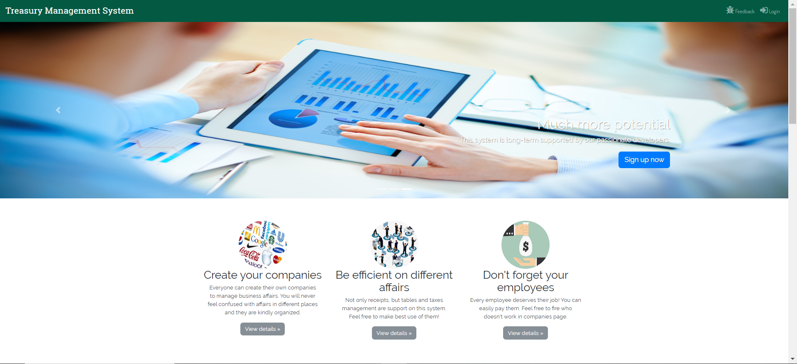
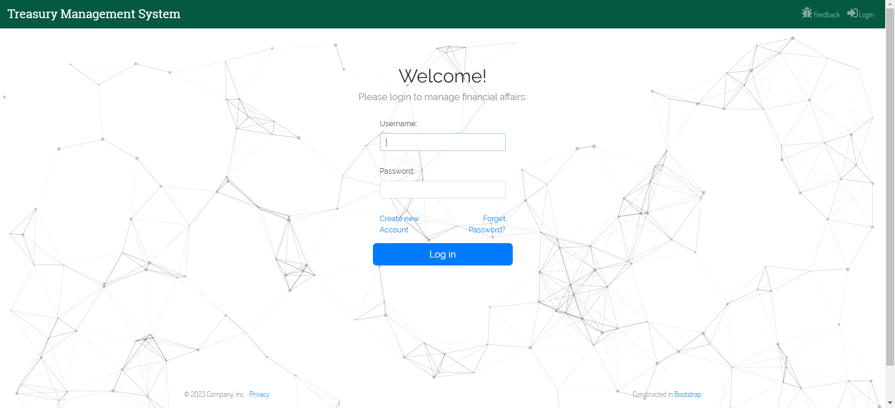
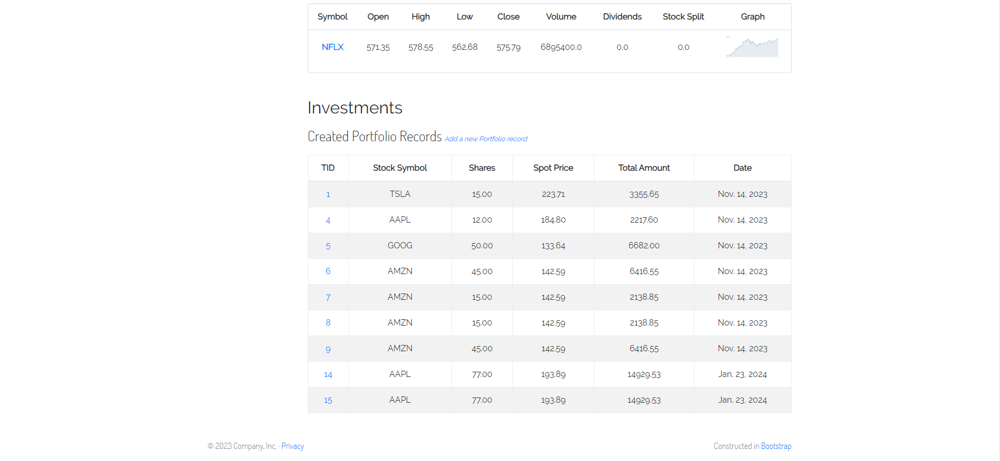

# Treasury Management System

*__ATTENTION:__ The Django version required by this project is vulnerable, __DO NOT__ serve it on a computer with public access. The project is only for learning.*

It is a Treasury management system which can help you manage your Organizatiom's affairs, salary, taxes, receipts and Investments Portfolios.

## Getting Started

```shell
# Python 3.6 and below is required
pip install -r requirements.txt

python manage.py migrate
python manage.py runserver
```

## Screenshots
*Homepage*


*Login Page*


*Investments Management Page*

